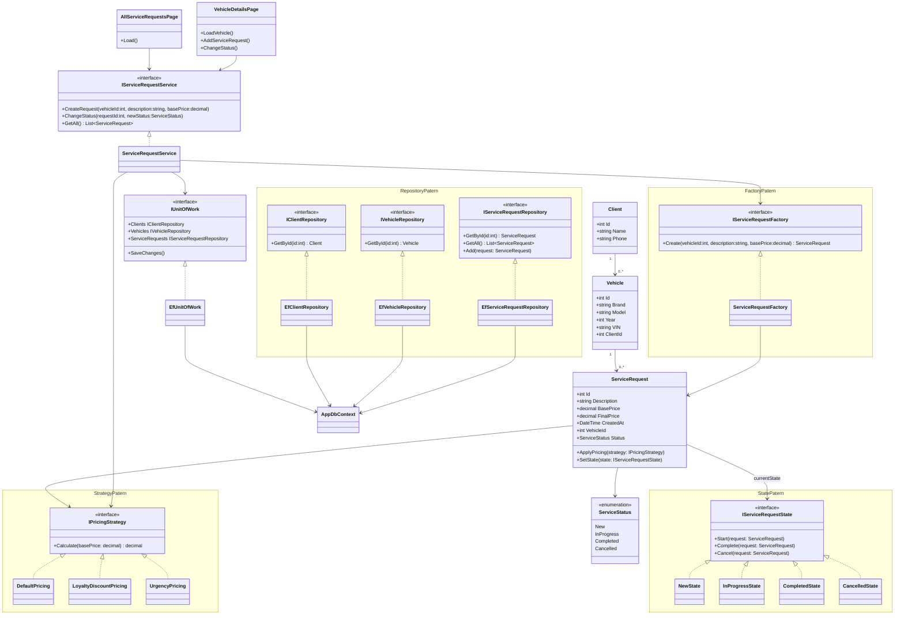

```mermaid
classDiagram
direction TB
	namespace StrategyPatern {
        class IPricingStrategy {
	        +Calculate(basePrice: decimal) decimal
        }

        class DefaultPricing {
        }

        class LoyaltyDiscountPricing {
        }

        class UrgencyPricing {
        }

	}
	namespace StatePatern {
        class IServiceRequestState {
	        +Start(request: ServiceRequest)
	        +Complete(request: ServiceRequest)
	        +Cancel(request: ServiceRequest)
        }

        class NewState {
        }

        class InProgressState {
        }

        class CompletedState {
        }

        class CancelledState {
        }

	}
	namespace FactoryPatern {
        class IServiceRequestFactory {
	        +Create(vehicleId:int, description:string, basePrice:decimal) ServiceRequest
        }

        class ServiceRequestFactory {
        }

	}
	namespace RepositoryPatern {
        class IServiceRequestRepository {
	        +GetById(id:int) ServiceRequest
	        +GetAll() List~ServiceRequest~
	        +Add(request: ServiceRequest)
        }

        class IVehicleRepository {
	        +GetById(id:int) Vehicle
        }

        class IClientRepository {
	        +GetById(id:int) Client
        }

        class EfServiceRequestRepository {
        }

        class EfVehicleRepository {
        }

        class EfClientRepository {
        }

	}
    class Client {
	    +int Id
	    +string Name
	    +string Phone
    }

    class Vehicle {
	    +int Id
	    +string Brand
	    +string Model
	    +int Year
	    +string VIN
	    +int ClientId
    }

    class ServiceRequest {
	    +int Id
	    +string Description
	    +decimal BasePrice
	    +decimal FinalPrice
	    +DateTime CreatedAt
	    +int VehicleId
	    +ServiceStatus Status
	    +ApplyPricing(strategy: IPricingStrategy)
	    +SetState(state: IServiceRequestState)
    }

    class ServiceStatus {
	    New
	    InProgress
	    Completed
	    Cancelled
    }

    class IServiceRequestService {
	    +CreateRequest(vehicleId:int, description:string, basePrice:decimal)
	    +ChangeStatus(requestId:int, newStatus:ServiceStatus)
	    +GetAll() List~ServiceRequest~
    }

    class ServiceRequestService {
    }

    class IUnitOfWork {
	    +Clients IClientRepository
	    +Vehicles IVehicleRepository
	    +ServiceRequests IServiceRequestRepository
	    +SaveChanges()
    }

    class EfUnitOfWork {
    }

    class AppDbContext {
    }

    class AllServiceRequestsPage {
	    +Load()
    }

    class VehicleDetailsPage {
	    +LoadVehicle()
	    +AddServiceRequest()
	    +ChangeStatus()
    }

	<<interface>> IPricingStrategy
	<<interface>> IServiceRequestState
	<<interface>> IServiceRequestFactory
	<<interface>> IServiceRequestRepository
	<<interface>> IVehicleRepository
	<<interface>> IClientRepository
	<<enumeration>> ServiceStatus
	<<interface>> IServiceRequestService
	<<interface>> IUnitOfWork

    Client "1" --> "0..*" Vehicle
    Vehicle "1" --> "0..*" ServiceRequest
    ServiceRequest --> ServiceStatus
    IServiceRequestState <|.. NewState
    IServiceRequestState <|.. InProgressState
    IServiceRequestState <|.. CompletedState
    IServiceRequestState <|.. CancelledState
    ServiceRequest --> IServiceRequestState : currentState
    IPricingStrategy <|.. DefaultPricing
    IPricingStrategy <|.. LoyaltyDiscountPricing
    IPricingStrategy <|.. UrgencyPricing
    ServiceRequest --> IPricingStrategy
    IServiceRequestFactory <|.. ServiceRequestFactory
    ServiceRequestFactory --> ServiceRequest
    IServiceRequestService <|.. ServiceRequestService
    ServiceRequestService --> IServiceRequestFactory
    ServiceRequestService --> IPricingStrategy
    ServiceRequestService --> IUnitOfWork
    IClientRepository <|.. EfClientRepository
    IVehicleRepository <|.. EfVehicleRepository
    IServiceRequestRepository <|.. EfServiceRequestRepository
    IUnitOfWork <|.. EfUnitOfWork
    EfUnitOfWork --> AppDbContext
    EfClientRepository --> AppDbContext
    EfVehicleRepository --> AppDbContext
    EfServiceRequestRepository --> AppDbContext
    AllServiceRequestsPage --> IServiceRequestService
    VehicleDetailsPage --> IServiceRequestService
```