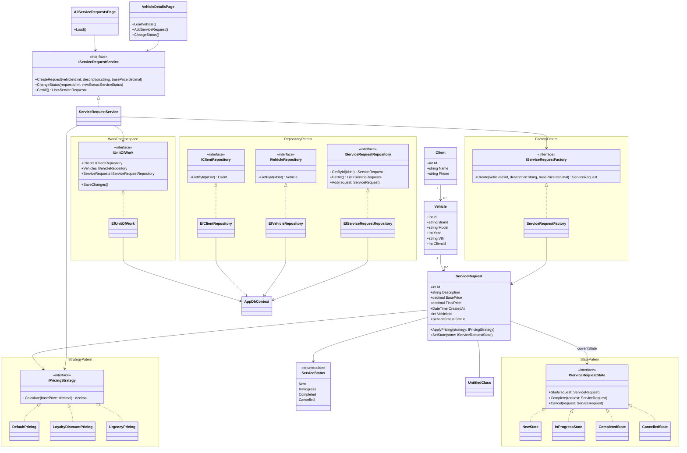

---
# У проєкті AutoServiceManagementSystem реалізовано декілька класичних шаблонів

## `Strategy Pattern`

### **Призначення**

### Патерн Strategy дозволяє змінювати алгоритм обчислення ціни без зміни самого класу ServiceRequest.

### Інтерфейс

```
public interface IPricingStrategy
{
    decimal Calculate(decimal basePrice);
}
```

#### Реалізації

`DefaultPricing` — стандартна ціна

`LoyaltyDiscountPricing` — знижка постійному клієнту

`UrgencyPricing` — націнка за терміновість

#### Як працює

Клас `ServiceRequest` не знає, яку саме формулу буде використано.
Він просто приймає стратегію:

`ApplyPricing(IPricingStrategy strategy)`

Таким чином:

* можна додати новий тип розрахунку

* не потрібно змінювати існуючий код

* дотримується принцип Open/Closed (SOLID)
---

## `State Pattern`

### **Призначення**

### Дозволяє змінювати поведінку заявки залежно від її стану.

#### Інтерфейс

```
public interface IServiceRequestState
{
    void Start(ServiceRequest request);
    void Complete(ServiceRequest request);
    void Cancel(ServiceRequest request);
}
```

**Реалізації станів**

* `NewState`

* `InProgressState`

* `CompletedState`

* `CancelledState`

#### Як працює

У класі `ServiceRequest` зберігається поточний стан:

`private IServiceRequestState currentState;`

**Коли змінюється статус:**

* логіка переходу виконується конкретним класом стану

* немає великого `switch-case`

* легко додати новий стан

---

## `Factory Pattern`

### **Призначення**

Інкапсулює створення об’єкта `ServiceRequest.`

#### Інтерфейс
```
public interface IServiceRequestFactory
{
    ServiceRequest Create(int vehicleId, string description, decimal basePrice);
}
```

#### **Реалізація**

`ServiceRequestFactory`

#### **Як працює**

Замість створення заявки через `new ServiceRequest()`, використовується фабрика:

`_serviceRequestFactory.Create(...)`

#### **Переваги:**

* централізоване створення об’єктів

* можна додати додаткову логіку ініціалізації

* зменшується зв’язність коду
---

## `Repository Pattern.`

### **Призначення**

Відокремлює логіку доступу до бази даних від бізнес-логіки.

#### Інтерфейси
```
IServiceRequestRepository
IVehicleRepository
IClientRepository
```
#### **Реалізації**

`EfServiceRequestRepository`

`EfVehicleRepository`

`EfClientRepository`

Вони працюють через `AppDbContext (Entity Framework Core)`.

#### **Як працює**

Сервіс не звертається напряму до бази даних.
Він використовує репозиторії:

`_unitOfWork.ServiceRequests.GetAll();`

#### **Переваги:**

* ізоляція `EF Core`

* можливість тестування без БД

* чиста архітектура
---

## Unit of Work Pattern

### **Призначення**

Об’єднує всі репозиторії та контролює збереження змін.

#### **Інтерфейс**
```
public interface IUnitOfWork
{
    IClientRepository Clients { get; }
    IVehicleRepository Vehicles { get; }
    IServiceRequestRepository ServiceRequests { get; }
    void SaveChanges();
}
```
#### **Реалізація**

`EfUnitOfWork`

#### **Як працює**

Замість виклику `SaveChanges` у кожному репозиторії:

`_unitOfWork.SaveChanges();`

#### **Переваги:**

* транзакційність

* централізоване збереження

* контроль змін
---

## `Service Layer`

#### **Інтерфейс**

`IServiceRequestService`

#### **Реалізація**

`ServiceRequestService`

#### **Призначення**

Міст між `UI` та `Repository`.

**`UI`-сторінки:**

`AllServiceRequestsPage`

`VehicleDetailsPage`

не працюють з БД напряму, а звертаються до сервісу.
---

## Як усе працює разом

* Користувач створює заявку

* `UI` викликає `IServiceRequestService`

* `Service:`

    *  використовує `Factory` для створення
    
    * застосовує `Strategy` для ціни

    * зберігає через `Repository`

    * викликає `UnitOfWork.SaveChanges()`

* При зміні статусу:

    * використовується `State Pattern`

    * змінюється поведінка заявки

#### **Переваги такої архітектури**

* Дотримання `SOLID`
* Масштабованість
* Легка підтримка
* Можливість модульного тестування
* Чіткий розподіл відповідальності